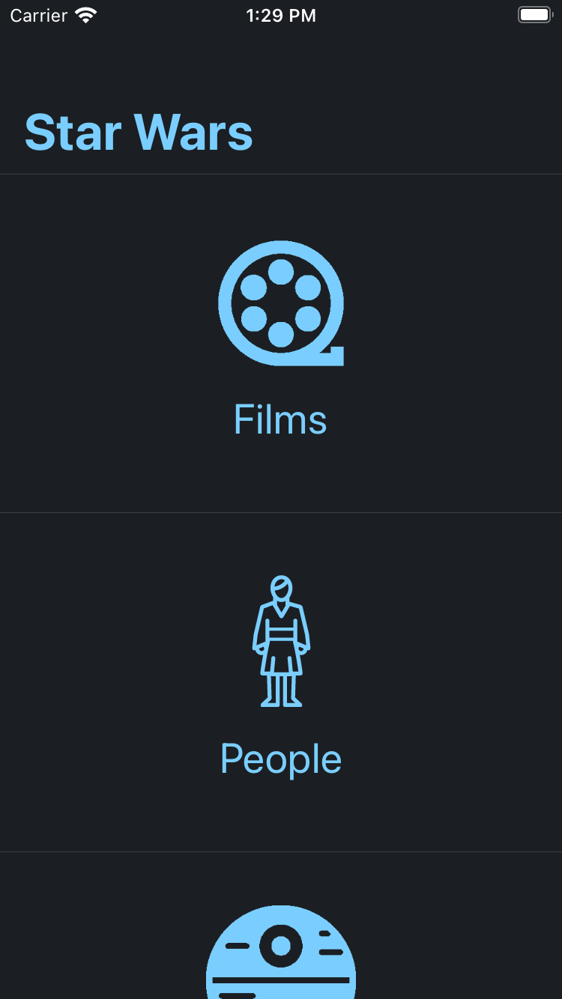
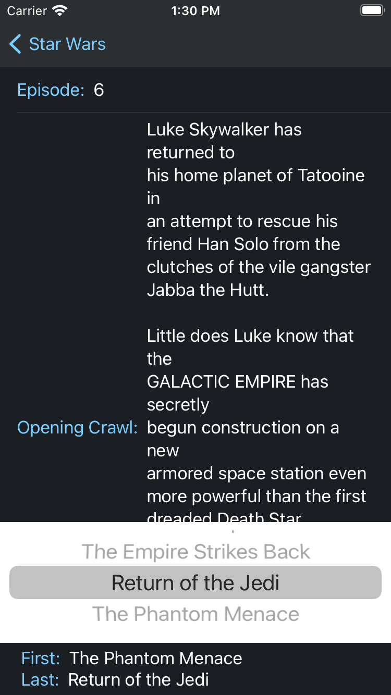

# StarWarsAPI

StarWarsAPI is a SwiftUI mobile app that uses the Star Wars API(SWAPI) [https://swapi.dev](https://swapi.dev) to display information on films, people, planets, species, starships, and vehicles.

 

This project contains the use of:
* APIs
* Endpoints
* Networking using Combine
* JSON and Data Modeling
* Generics
* Unit Tests
